# Remote Agent Sequences and Modules

> **** 
>  [API ](./remote-agent-access.md) 
>  [](../api-gateway/remote-agent-access.md#implementation-order-and-acceptance)

 [](./remote-agent-implementation.md)

[](../api-gateway/remote-agent-access.md#shared-infrastructure-for-configuration-transfer-and-agent-access)
 Agent S01  Agent
 Agent 

WebSocketJSON-RPC
JSON-RPC `id` 
`commandId` `epoch + seq` 
 `sessions.*``messages.*``subscriptions.*`  `agent.*` 
 Agent/session/workspace 
`grantId`  ID ID 

 PR #20717 `remoteAccess`
`RemoteCommandService`  owner 

## Module map

```mermaid
flowchart TB
    subgraph Mobile
        UI[ UI]
        M1[M1  RPC]
        M2[M2 ]
        M3[(M3 )]
        UI --> M2
        M2 --> M1
        M2 --> M3
    end
    P[P <br/>Schema /  /  reducer]
    M1 -.  .-> P
    M2 -.  .-> P
    subgraph Desktop
        D1[D1 Gateway  RPC ]
        D2[D2 ]
        D3[D3 ]
        D4[D4 Agent ]
        D5[(D5 )]
        D1 --> D2
        D1 --> D3
        D1 --> D4
        D1 --> D5
        D4 --> D5
        D4 -->|| D3
    end
    M1 <-->| JSON-RPC| D1
    D1 -.  .-> P
    D3 -.  .-> P
```

|  |  |  |
|---|---|---|
| **P ** | JSON-RPC Agent DTO reducer |  `packages/remote-protocol` `/agent` socket |
| **M1  RPC** |  | Mobile  `src/backend/services/remoteAccess` JSON-RPC  |
| **M2 ** | ACK |  Mobile  `src/shared/contracts`  |
| **M3 ** |  desktop/device/grantId/protocolVersion/session  | Mobile `src/backend/data`  |
| **D1 Gateway  RPC ** |  |  `src/main/features/apiGateway` `src/main/services/remoteAccess` |
| **D2 ** | Agent / |  paired-device provider  Agent  |
| **D3 ** | /protocolVersion  epoch |  `RemoteAgentSubscription.ts` / Agent |
| **D4 Agent ** |  stream listener// |  `AiStreamManager`Agent lifecycle/runtime remoteAccess |
| **D5 ** | /tombstone |  `RemoteCommandService` |
| **R Relay** |  Desktop |  Go relay Agent  Agent |

 D1→D4  remote adapterD4  D3 
D3  D4  StreamListeneraddListener observeTopic  runtime D4  D3P 

## Connection states

```mermaid
stateDiagram-v2
    [*] --> Offline
    Offline --> Connecting: 
    Connecting --> Securing: WS 
    Securing --> Negotiating: 
    Negotiating --> Pairing: 
    Pairing --> Authenticating: 
    Negotiating --> Authenticating: 
    Authenticating --> Connected: 
    Connected --> Recovering: 
    Recovering --> Ready: 
    Ready --> Recovering:  resetRequired
    Ready --> Authenticating: 
    Connected --> Backoff: 
    Recovering --> Backoff: 
    Ready --> Backoff: 
    Connecting --> Backoff: 
    Backoff --> Connecting: 
    Negotiating --> Blocked: 
    Authenticating --> Blocked: 
    Securing --> Blocked: 
    Pairing --> Blocked: 
    Blocked --> Connecting: 
    Ready --> Offline: 
    Backoff --> Offline: 
```

 Backoff
“Connected”Ready  UI 
 wire 
M1  generation
 activate  subscribe 
highWatermarkReady  Desktop 
 UI  RPC 

## Scenario index

|  |  |  |
|---|---|---|
| [S01 ](#s01-first-pairing) | M1D1D2 |  |
| [S02 ](#s02-version-negotiation) | M1PD1 |  |
| [S03 ](#s03-checkpoint-and-activation) | M2M3D3D4 |  |
| [S04 ](#s04-send-and-stream) | M2M3D1D3D4D5 |  |
| [S05 ](#s05-lost-command-receipt) | M2M3D4D5 |  commandId  |
| [S06 ](#s06-reconnect-and-replay) | M1M2M3D3 |  |
| [S07  Desktop ](#s07-reset-and-desktop-restart) | M2D3D4D5 |  Agent |
| [S08 Mobile ](#s08-mobile-crash) | M2M3D3 |  |
| [S09 ](#s09-approval-race) | M2D2D4D5 | / |
| [S10 ](#s10-cancellation-race) | D1D4D5 |  E1  E2 |
| [S11 ](#s11-expiry-and-revocation) | M1D1D2D3 |  |
| [S12  ACK](#s12-backpressure) | M2M3D3 |  Agent ACK  |
| [S13 Relay ](#s13-relay-interruption) | M1RD1D3 |  epoch  |

## S01 First pairing

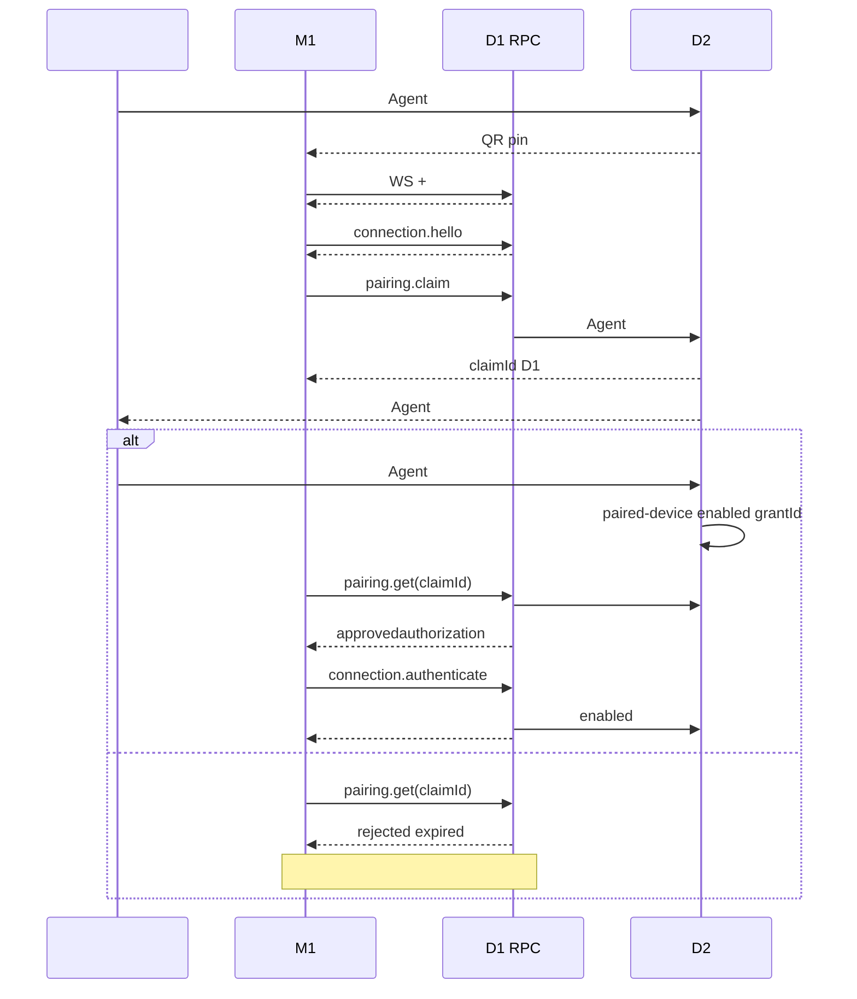

****  provider token  Agent


## S02 Version negotiation

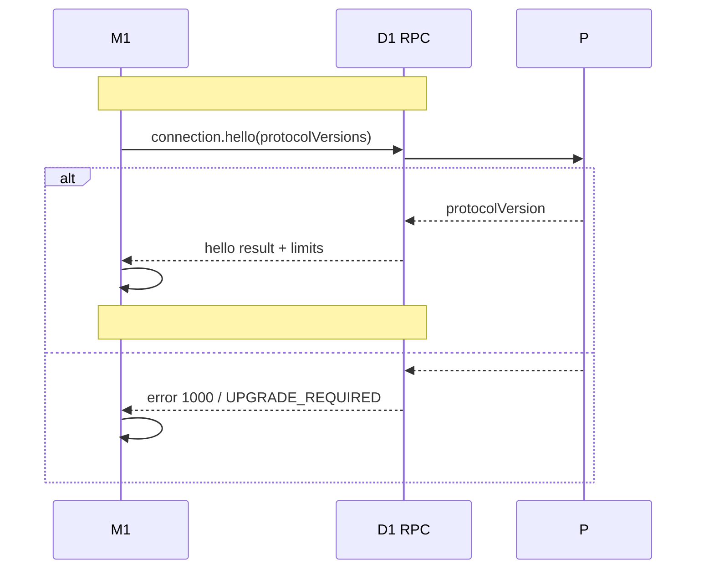

**** `jsonrpc: "2.0"` Mobile/Desktop 
 capabilities 

## S03 Checkpoint and activation

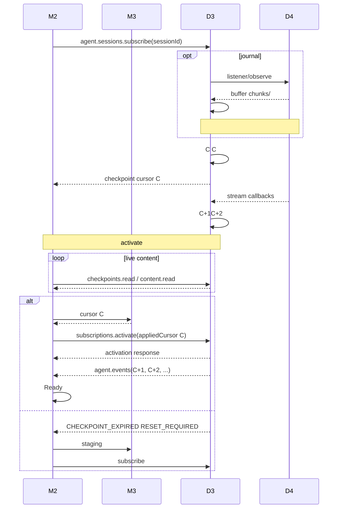

**** / chunks journal 
 checkpoint C  API


## S04 Send and stream

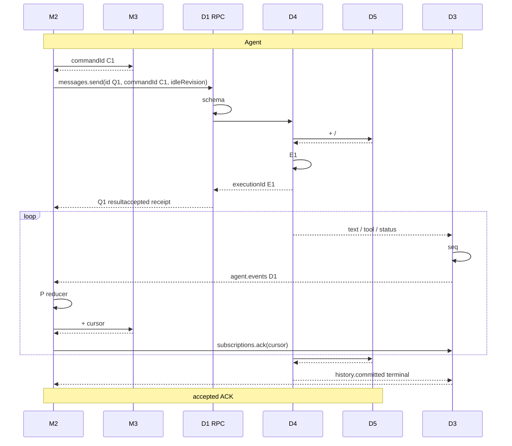

**** UI “” C1 


## S05 Lost command receipt

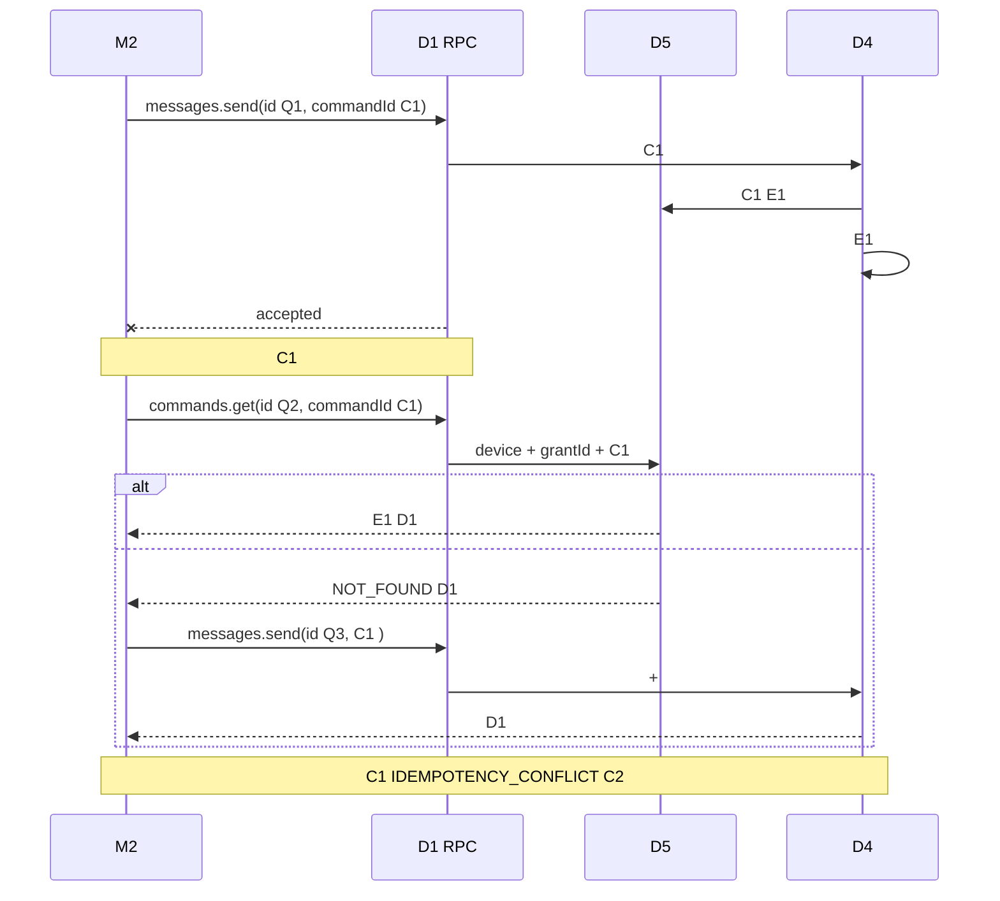

**** “” C1 

## S06 Reconnect and replay

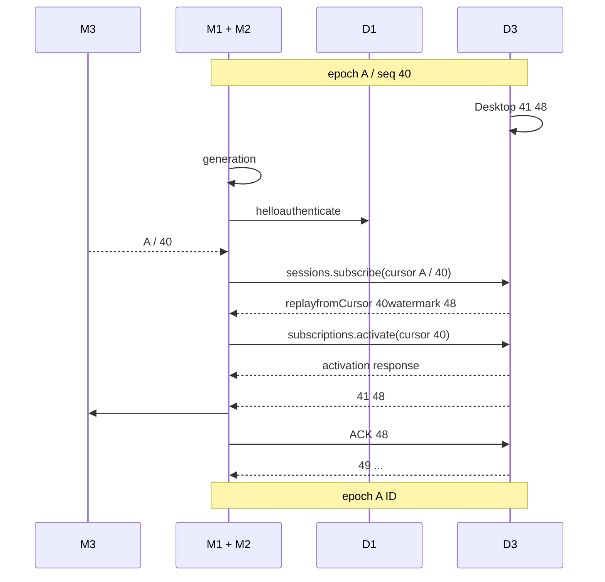

****  seq

## S07 Reset and desktop restart

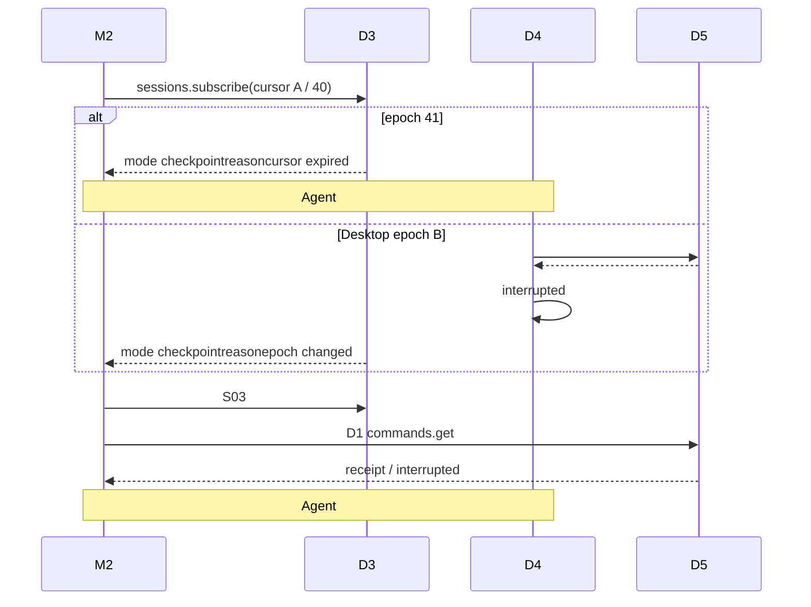

****  epoch  ACK
 Agent 

## S08 Mobile crash

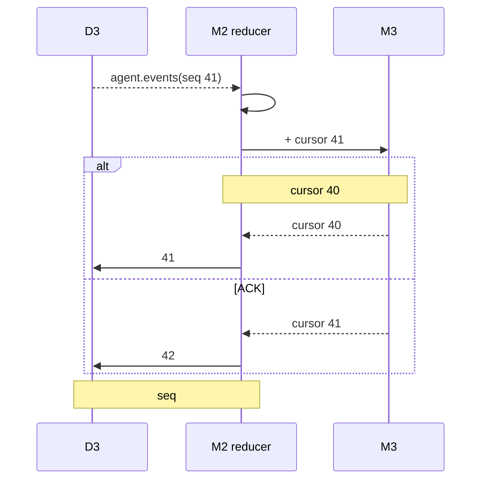

**** “ 41 40”


## S09 Approval race

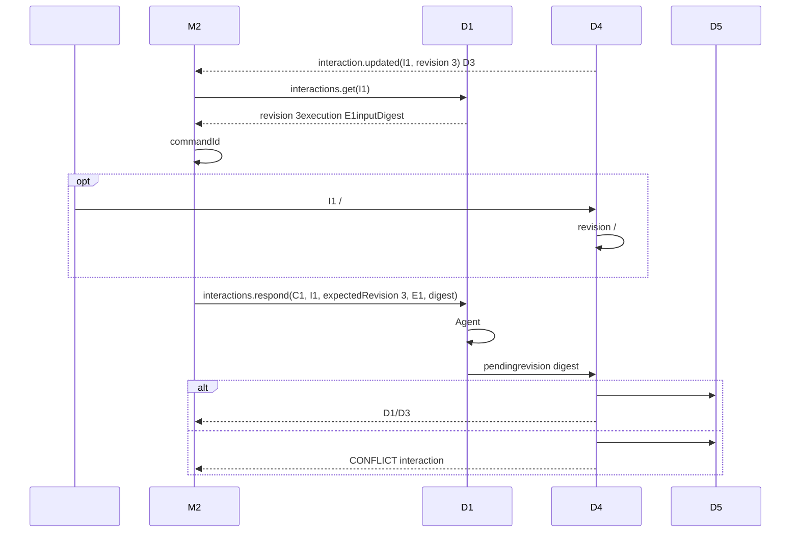

****  commandId 
 RPC 

## S10 Cancellation race

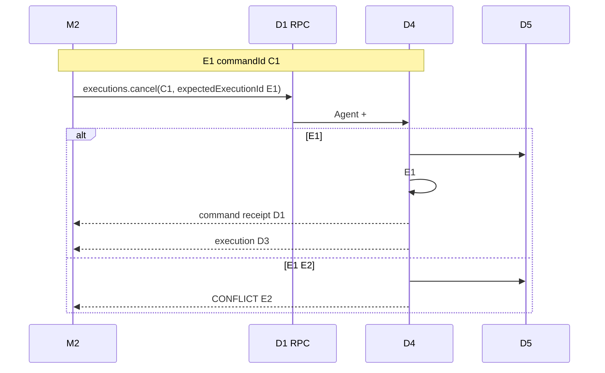

****  RPC 


## S11 Expiry and revocation

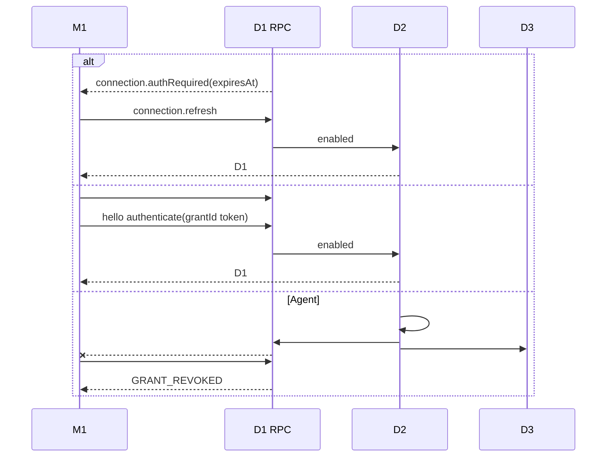

****  refresh/ping token 


## S12 Backpressure

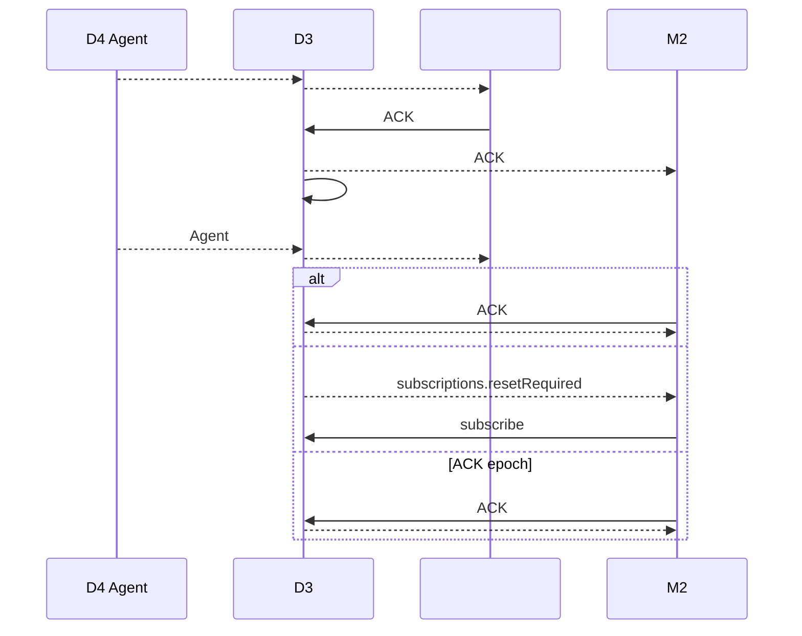

****  bulk  TCP 
 reset 

## S13 Relay interruption

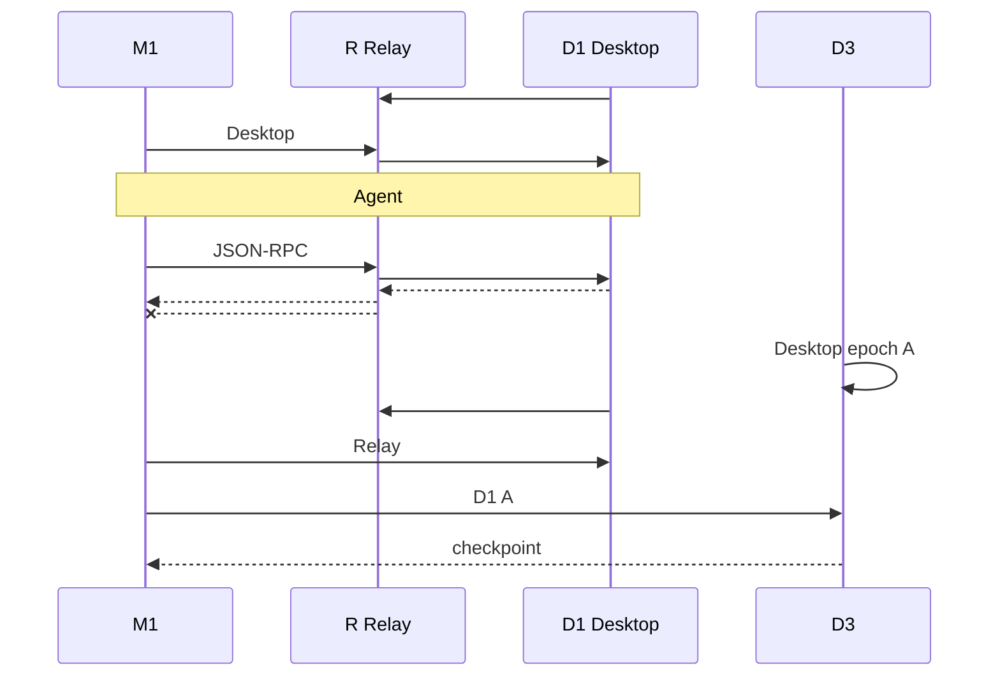

****  Agent Relay  JSON-RPC seq
 epochDesktop 

## Implementation slices

|  |  |  |
|---|---|---|
|  | PM1/D1  RPC  | S02 JSON-RPC //batch |
|  | D3D4D5M2/M3  | S03S04S05S07S08S12 |
|  Desktop  | D1D2 | S01S09S10S11 |
|  | M1M2M3UI | S01  S12 |
| Relay | RM1/D1 reachability adapter | S13 Agent  |


 mock 
