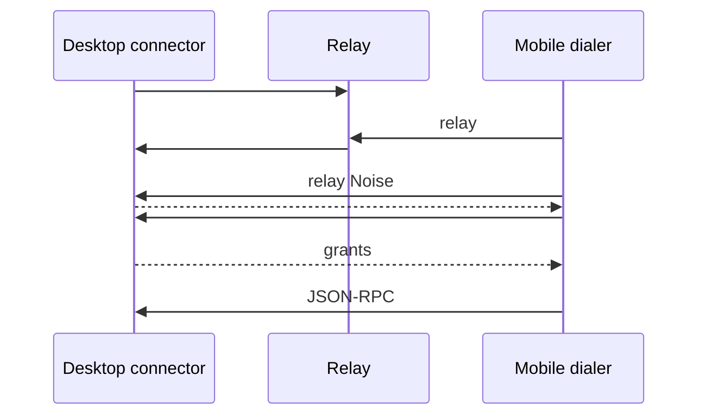

# Remote Connectivity Design

> 2026-09-23
>  relay 
> 

 ownership
[](./remote-agent-access.md)
[Agent API](../ai/remote-agent-access.md) RPCcheckpoint 
[API Gateway](./README.md) HTTP  WebSocket 

## 

-  `RemoteAdvertisement`  Bonjour  `_cherry-remote._tcp`TXT 
  SRV  Gateway  IPv4 listener Gateway  owner lifecycle 
-  API 
  
-  Expo  ResolverManager  15 socket
   4  6  RemoteDialer 
-  8  QR  16 QR 5  60 
   scope  grants 
-  schema  `configured_endpoints` IP/port 
   QR  connectionId
-  Noise  authenticate 
  
- Android 34+ 
   Android 
-  Keychain  relayVPN SDK 

## 1. 


 IP 
 Wi-Fi  Wi-Fi DHCP 


 `192.168.1.102:23335`  `192.168.71.127`
 WebSocket `101`
 Noise Agent 

2026-09-23 

|  |  |  |
|---|---|---|
| Desktop `ApiGatewayService.getLanEndpoint()` |  IPv4  |  |
| Desktop `RemoteAccessService` |  WebSocket |  LAN  |
| Mobile `DesktopConnectionRuntime.pair()` |  |  |
| Mobile `DesktopConnectionManager` |  owner |  |
| Mobile `DesktopSession.connect()` |  Noise  hello |  |
| Shared `connectSecureChannel()` |  `MessageStream`  Noise  |  |

 superagent-app  `src/backend/services/desktopConnections/`
 `bonjour-service` 

## 2. 

 LAN DNS-SD/mDNS /IP 
 Tailscale/ZeroTier  VPN SDK
relay NAT  multicast  socket


1. IP relay 
2.  Noise 
3.  scope
4.  host  domain 
5. AgentMCP socket
6.  HTTP/MCP  relay 
7. 
8. 

## 3. 

```mermaid
flowchart TD
  UI[] --> DOM[Agent /  domain]
  DOM --> MAN[DesktopConnectionManager ]
  MAN --> RES[DesktopEndpointResolver ]
  RECENT[] --> RES
  NSD[ DNS-SD ] --> RES
  CFG[ IP] --> RES
  DIR[] -.-> RES
  MAN --> DIAL[RemoteDialer]
  DIAL --> DIRECT[ WebSocket]
  DIAL -.-> RELAY[ relay ]
  DIRECT --> SESSION[DesktopSession: Noise /  / JSON-RPC]
  RELAY -.-> SESSION
  SESSION --> RESTORE[]
```

mDNS VPN  relay 
 `mdns | tailscale | relay` VPN 

| Owner |  |  |
|---|---|---|
| Desktop `ApiGatewayService` |  listener  | Bonjour Agent  |
| Desktop `RemoteAccessService` |  |  |
| Desktop `RemoteAdvertisement` |  |  listener |
| Mobile  | / |  |
| Mobile `DesktopEndpointResolver` |  |  |
| Mobile `RemoteDialer` |  | Noise  |
| Mobile `DesktopSession` | RPC | AppState |
| Mobile `DesktopConnectionManager` |  |  |
| Mobile domain runtime |  |  LAN/VPN/relay |

 owner  lifecycle `RemoteAdvertisement`  `RemoteAccessService`  dispose 
 singleton resolver  AppState owner
 Bonjour 

## 4. 

### 4.1 

 `connectionId``desktopIdentity``deviceId`domain grants  identity-bound scope
“”`connectionId`  socket

/invalidate  command journal 
 MAC IP 


### 4.2 


|  |  |  |
|---|---|---|
|  hostname/IP + port |  |  Noise  |
|  QR  |  |  |
| NSD  | TTL  |  |
|  |  |  |
| WebSocket |  ready |  |
|  relay  |  |  |

 DNS  IP 

relay 

### 4.3 

deviceIdgrantsconnectionId  legacy 
 `addresses[] + port`  QR 

 schema 


 desktop 


“”

## 5. 

 API
relay  registry

```ts
type DirectRoute = {
  kind: 'direct'
  host: string
  port: number
  security: 'ws' | 'wss'
}

type RelayRoute = {
  kind: 'relay'
  relayOrigin: string
  targetRef: string
}

type RouteCandidate = {
  candidateId: string
  networkGeneration: number
  source: 'configured' | 'discovery' | 'invitation' | 'directory'
  expiresAt?: number
  route: DirectRoute | RelayRoute
}

type ResolutionEvent =
  | { type: 'upsert'; candidate: RouteCandidate }
  | { type: 'remove'; candidateId: string }
  | { type: 'status'; source: RouteCandidate['source']; state: 'searching' | 'unavailable' | 'permission-denied' }

interface EndpointResolver {
  watch(target: PairedDesktopTarget, signal: AbortSignal): AsyncIterable<ResolutionEvent>
}

interface RemoteDialer {
  open(candidate: RouteCandidate, signal: AbortSignal): Promise<OpenedTransport>
}

interface OpenedTransport {
  stream: MessageStream
  close(): Promise<void>
}
```

`PairedDesktopTarget` `MessageStream`  transport 
`DesktopSession` 
 WebSocket  dialer transport  Noise 
QR  resolver  source


- resolver 
- `AbortSignal`  browse/resolve async iterator 
- /resolver 
-  route
- 
- route  relay / DTO
- host URL userinfo HTTP 
- IPv4  IPv6IPv6 link-local  RN  URL
-  TTL  TTL 

## 6. DNS-SD 

### 6.1 

 `_cherry-remote._tcp` 
SRV TXT 
 Noise/JSON-RPC TXT 

 instance name 
relay 


 listener  preference
/

 HTTP 

 `bonjour-service`  mDNS 
 LAN  RFC1918 

### 6.2 

Android  NSDApple  Bonjour  API Expo/RN 
 Expo module  API
 JS  UDP multicast 

 OS/SDK  Bonjour 
 Android  target SDK  OS 


/“” LAN  SSID 


## 7. 

### 7.1 

1.  domain 
2.  IP  2 
3. 
4.  Noise 
5.  host 
6.  domain 
7.  jitter 

 idle grace 
“”
 lost  socket 
 manager  suspended

### 7.2 

|  |  |  |
|---|---|---|
| DNS  | / |  |
|  Noise  |  |  |
|  |  |  |
|  |  |  |
|  |  |  |
|  domain grant  |  |  domain  |
|  | / |  |
|  | offline |  |
| / |  |  |

 `UnexpectedPeerError → UNAUTHENTICATED → needs-repair` 
 IP 


## 8. 

 identity/grant 

- Agent  `connectionId`scope epoch  checkpoint
-  `commandId` /
-  discovery 
-  configuration /
-  BonjourVPN  relay 

“”/IP 
“/”“”“”“”“”
 UI 


1. 
2.  QR  `pairing.claim`

 grants QR 
“”“” parser 
 QR wire 

## 9. VPN  relay 

### 9.1 Tailscale / ZeroTier

 VPN  IP  direct route WebSocket  Noise
Tailscale MagicDNS  Cherry / mDNS  tailnet
ZeroTier  multicast 
/IP  IP

 DNSVPN  VPN  API Agent 
Tailscale  DERP  Cherry  Cherry  relay
 Wi-Fi  VPN “ Wi-Fi”

### 9.2  relay

 relay  TLS relay 
relay /
 Noise  relay /



relay  Noise  grants Agent 
relay 
 relay `targetRef` 


- `RemoteAccessService`  `IngressContext` LAN socket
- context  direct/relay
- direct relay  relay //RPC 
-  relay  localhost  HTTP  loopback  relay  MCP/ API 
-  `closeIngress()` 
-  relay  IP /

“”“”“relay ” relay 
 direct relay  relay
 LAN relay  UI
 relay 

relay  IP  relay
 relay  LAN  Noise  socket 
relay /

## 10. 

/

|  | / |  |
|---|---|---|
| Desktop | `src/main/services/remoteAccess/RemoteAdvertisement.ts` |  owner  |
| Desktop | `src/main/services/remoteAccess/RemoteAccessService.ts` |  |
| Desktop | `src/main/features/apiGateway/ApiGatewayService.ts` |  listener  |
| Shared | `packages/remote-protocol/src/discovery.ts` |  TXT  API |
| Shared | `packages/remote-transport/src/channel.ts` |  Noise  |
| Mobile | `src/backend/services/desktopConnections/DesktopEndpointResolver.ts` |  |
| Mobile | `src/backend/services/desktopConnections/connectionRoutes.ts` |  |
| Mobile | `src/backend/services/desktopConnections/remoteDialer.ts` | direct  relay |
| Mobile | `src/backend/services/desktopConnections/DesktopSession.ts` |  |
| Mobile | `src/backend/services/desktopConnections/DesktopConnectionManager.ts` |  |
| Mobile | `src/backend/services/desktopConnections/desktopDiscovery.ts` | JS  |
| Mobile | `modules/remote-discovery/` |  Expo  |
| Mobile |  |  |

 code-organization  public entry  UI  backend 
 Agent  wire 


1. **** dialer
2. ****/IP 
3. **** Android/iOS  resolver
4. ****
5. **** LAN 

 2–4 

 relay /relay adapter connector  Agent RPC 
 Mobile #1055 → #997 stack PR PR review

## 11. 

 resolver  manager 
 Noise  socket open 

|  |  |
|---|---|
| DHCP  IP |  identity/grants |
| / |  needs-repair |
|  |  |
| / |  socket  |
| Wi-Fi  | / |
| Android/iOS  |  |
|  LAN  |  |
| multicast  |  |
| Tailscale/ZeroTier  IP |  mDNS DNS// |
|  | / |
|  configuration / Agent grant |  domain |
|  |  checkpoint  commandId |
| / |  |
|  | QR  |
|  |  QR  desktop  |
|  |  |
|  |  API  |
|  relay // |  loopback  |


DNSsocketNoise
/IP 
/P95
 OS commit

## 12. Review 


-  LAN /IP  VPN relay 
- 
- 
- 
-  host /

IPv6 scope Bonjour 


 owner

- [RFC 6763: DNS-Based Service Discovery](https://www.rfc-editor.org/rfc/rfc6763.html)SRV/TXT 
- [RFC 6762: Multicast DNS](https://www.rfc-editor.org/rfc/rfc6762.html) multicast 
- [Android NSD](https://developer.android.com/develop/connectivity/wifi/use-nsd)
- [Android NsdManager](https://developer.android.com/reference/android/net/nsd/NsdManager) API
- [Apple Bonjour](https://developer.apple.com/documentation/foundation/bonjour/)  [](https://developer.apple.com/documentation/technotes/tn3179-understanding-local-network-privacy)
- [Tailscale MagicDNS](https://tailscale.com/docs/features/magicdns)  [](https://tailscale.com/docs/reference/connection-types) Tailscale  relay
- [ZeroTier DNS](https://docs.zerotier.com/dns-management/)  [](https://docs.zerotier.com/protocol/) multicast 
